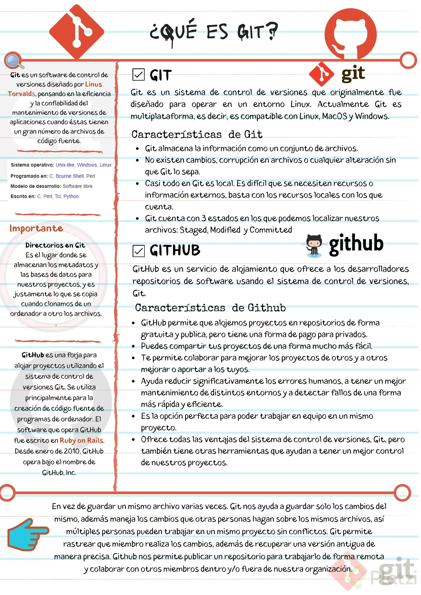

# Curso de GIT

Imagen de Obtenida de Platzi:...

## Configuracion de git

Lista de configuracion `git config`

Configurar git desde editor de codigo `git config --global -e`

configuracion global user`git config --global user.name "Gusatavo Caqui"`

configuracion global email`git config --global user.email "gustavo@gmail.com"`

Listar configuracion `git config --list`

## Comandos Iniciales

inicializar seguimiento del directorio `git init`

añadir un archivo `git add miArchivo`

retirar del estado add (--cached = retirar del almacemanimto)`git rm --cached miArchivo`

Mostrar todo el historial de git `git log`

Mostrar historial de cambios en un arhcivo `git show miArchivo`

Mostrar cambios entre commits `git diff codigoHash1 codigoHAash2`

 
volver en el tiempo en nuestro repositorio (--hard = )`git reset codigoHash  --hard`

ver cambios iniciales de cualquier commit `git checkout codigoHash miArchivo`

regresar a la rama master `git checkout master miArchivo`
